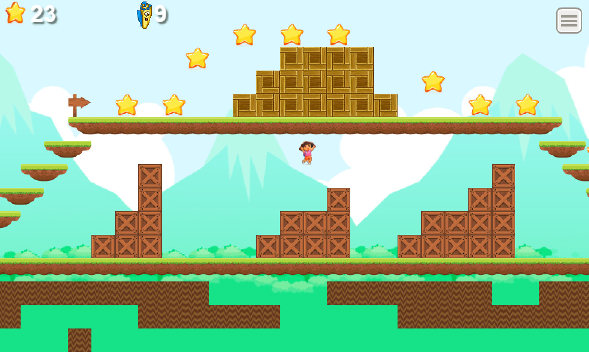
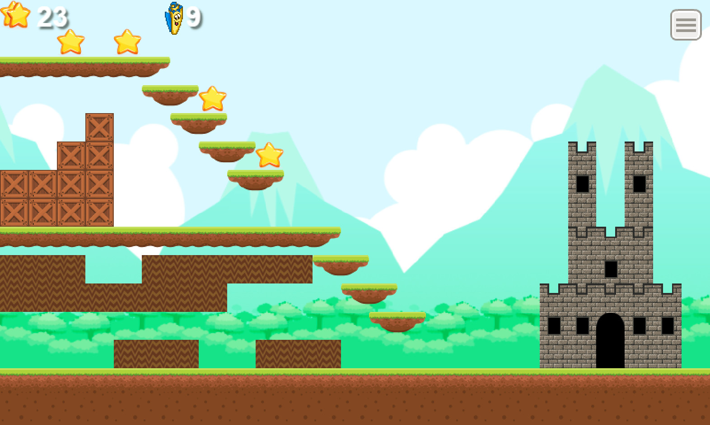
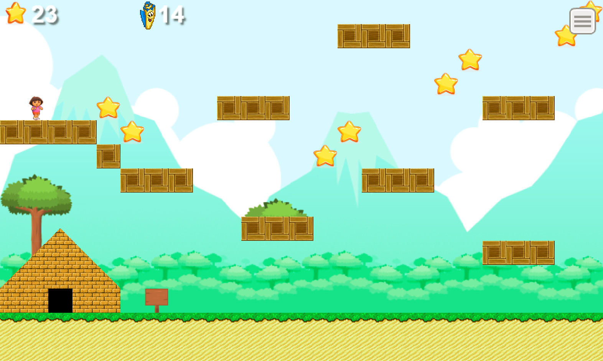
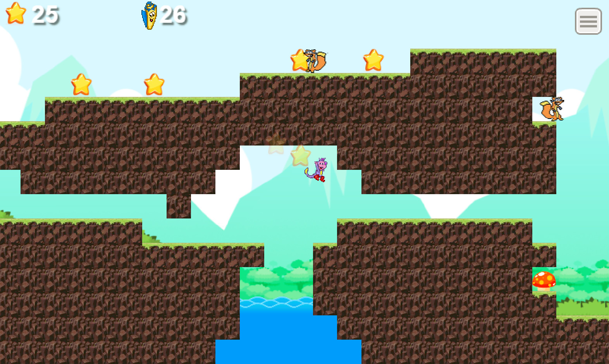
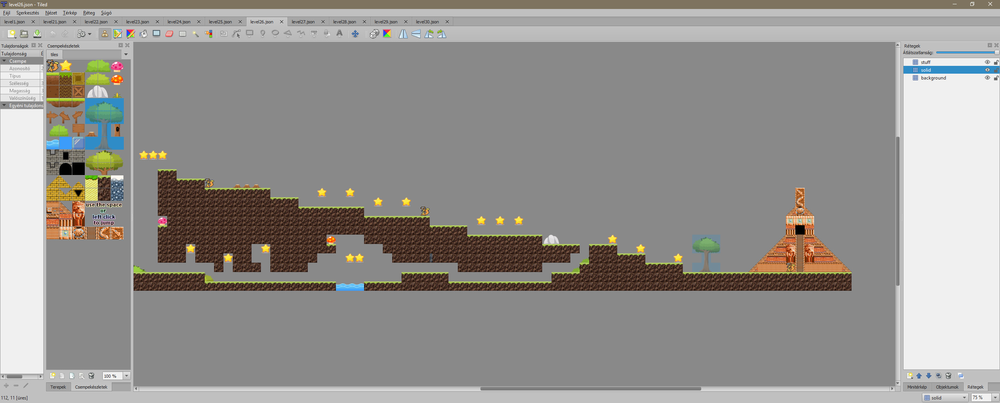

<style>
  .image-gallery img {
    display: inline-block;
    width: 400px;
  }
  .image-gallery img:hover {
    filter: brightness(110%);
    -webkit-filter: brightness(110%);
  }
  img {
    max-width: 40%;
  }
</style>


> Dora the explorer platformer game for the little children's. Easy to use one-key control (space or left click) and adjustable game speed.

[](https://github.com/robcaa/great-run/watchers)
[](https://github.com/robcaa/great-run/stargazers)
[](https://github.com/robcaa/great-run/network)

[](https://github.com/robcaa/great-run/commits/master)
[](https://github.com/robcaa/great-run/issues)
[](https://github.com/robcaa/great-run/pulls)
[](https://github.com/robcaa/great-run/commits/master)


## Features:
- Nonviolent platformer game for the little children's
- Easy to use one-key control (space or left click) and adjustable game speed.
- 30 level with three map type:
  - First ten level: You can not fall off or die
  - Second ten level: You can fall off
  - Third ten level: Swiper the fox appears
- Two player skin:
  - Dora
  - Boots
- Easily change or restart levels
- Dora the explorer musics and sounds


## Links
[PLAY THE GAME](https://robertgirhiny.com/projects/great-run)

[DOWNLOAD THE GAME FOR WINDOWS](https://robertgirhiny.com/projects/great-run/great_run.zip)


## Menu


## Screenshots:
<div class="image-gallery">
  <a href="readme/2.jpg"></a>
  <a href="readme/3.jpg"></a>
  <a href="readme/4.jpg"></a>
  <a href="readme/5.jpg"></a>
  <a href="readme/6.jpg"></a>
</div>


## Setup / Build:
- Install dependencies: ```npm install```
- Run the dev server: ```npm run server:dev```
- Generate Assets Class: ```npm run assets```
- Build for release: ```npm run build:dist```
- Desktop Build via Electron to win32: ```npm run electron:pack:dist -- --platform win32 --arch=ia32```

This game was created with the awesome [Phaser NPM Webpack TypeScript Starter Project](https://github.com/rroylance/phaser-npm-webpack-typescript-starter-project)

Big thank you to them

Used Map editor: [Tiled Map Editor](https://www.mapeditor.org/)

You can find the maps in ```/assets/JSON``` folder. The tile texture: ```/assets/images/tile.png```


## Author
Robert Girhiny

[WEB](https://robertgirhiny.com)

Email: robcaa@gmail.com


